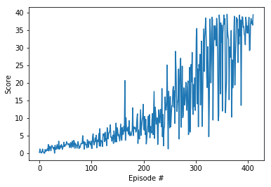

# Continuous Control

---

You are welcome to use this coding environment to train your agent for the project.  Follow the instructions below to get started!

### 1. Start the Environment

Run the next code cell to install a few packages.  This line will take a few minutes to run!


```python
!pip -q install ./python

# import the necessary packages
import matplotlib.pyplot as plt
%matplotlib inline

!python -m pip install pyvirtualdisplay
from pyvirtualdisplay import Display
display = Display(visible=0, size=(1400, 900))
display.start()

is_ipython = 'inline' in plt.get_backend()
if is_ipython:
    from IPython import display

plt.ion()
```

    Collecting pyvirtualdisplay
      Downloading https://files.pythonhosted.org/packages/39/37/f285403a09cc261c56b6574baace1bdcf4b8c7428c8a7239cbba137bc0eb/PyVirtualDisplay-0.2.1.tar.gz
    Collecting EasyProcess (from pyvirtualdisplay)
      Downloading https://files.pythonhosted.org/packages/0d/f1/d2de7591e7dfc164d286fa16f051e6c0cf3141825586c3b04ae7cda7ac0f/EasyProcess-0.2.3.tar.gz
    Building wheels for collected packages: pyvirtualdisplay, EasyProcess
      Running setup.py bdist_wheel for pyvirtualdisplay ... [?25ldone
    [?25h  Stored in directory: /root/.cache/pip/wheels/d1/8c/16/1c64227974ae29c687e4cc30fd691d5c0fd40f54446dde99da
      Running setup.py bdist_wheel for EasyProcess ... [?25ldone
    [?25h  Stored in directory: /root/.cache/pip/wheels/b4/c6/e3/c163b04029d8fccfd54b809802640c1af587a01be8d7a04e1a
    Successfully built pyvirtualdisplay EasyProcess
    Installing collected packages: EasyProcess, pyvirtualdisplay
    Successfully installed EasyProcess-0.2.3 pyvirtualdisplay-0.2.1
    You are using pip version 9.0.1, however version 18.1 is available.
    You should consider upgrading via the 'pip install --upgrade pip' command.


The environments corresponding to both versions of the environment are already saved in the Workspace and can be accessed at the file paths provided below.  

Please select one of the two options below for loading the environment.


```python
from unityagents import UnityEnvironment
import numpy as np

# select this option to load version 1 (with a single agent) of the environment
env = UnityEnvironment(file_name='/data/Reacher_One_Linux_NoVis/Reacher_One_Linux_NoVis.x86_64')

# select this option to load version 2 (with 20 agents) of the environment
# env = UnityEnvironment(file_name='/data/Reacher_Linux_NoVis/Reacher.x86_64')
```

    INFO:unityagents:
    'Academy' started successfully!
    Unity Academy name: Academy
            Number of Brains: 1
            Number of External Brains : 1
            Lesson number : 0
            Reset Parameters :
    		goal_size -> 5.0
    		goal_speed -> 1.0
    Unity brain name: ReacherBrain
            Number of Visual Observations (per agent): 0
            Vector Observation space type: continuous
            Vector Observation space size (per agent): 33
            Number of stacked Vector Observation: 1
            Vector Action space type: continuous
            Vector Action space size (per agent): 4
            Vector Action descriptions: , , , 


Environments contain **_brains_** which are responsible for deciding the actions of their associated agents. Here we check for the first brain available, and set it as the default brain we will be controlling from Python.


```python
# get the default brain
brain_name = env.brain_names[0]
brain = env.brains[brain_name]
```

### 2. Examine the State and Action Spaces

Run the code cell below to print some information about the environment.


```python
# reset the environment
env_info = env.reset(train_mode=True)[brain_name]

# number of agents
num_agents = len(env_info.agents)
print('Number of agents:', num_agents)

# size of each action
action_size = brain.vector_action_space_size
print('Size of each action:', action_size)

# examine the state space 
states = env_info.vector_observations
state_size = states.shape[1]
print('There are {} agents. Each observes a state with length: {}'.format(states.shape[0], state_size))
print('The state for the first agent looks like:', states[0])
```

    Number of agents: 1
    Size of each action: 4
    There are 1 agents. Each observes a state with length: 33
    The state for the first agent looks like: [  0.00000000e+00  -4.00000000e+00   0.00000000e+00   1.00000000e+00
      -0.00000000e+00  -0.00000000e+00  -4.37113883e-08   0.00000000e+00
       0.00000000e+00   0.00000000e+00   0.00000000e+00   0.00000000e+00
       0.00000000e+00   0.00000000e+00  -1.00000000e+01   0.00000000e+00
       1.00000000e+00  -0.00000000e+00  -0.00000000e+00  -4.37113883e-08
       0.00000000e+00   0.00000000e+00   0.00000000e+00   0.00000000e+00
       0.00000000e+00   0.00000000e+00   5.75471878e+00  -1.00000000e+00
       5.55726671e+00   0.00000000e+00   1.00000000e+00   0.00000000e+00
      -1.68164849e-01]


### 3. Take Random Actions in the Environment

In the next code cell, you will learn how to use the Python API to control the agent and receive feedback from the environment.

Note that **in this coding environment, you will not be able to watch the agents while they are training**, and you should set `train_mode=True` to restart the environment.


```python
env_info = env.reset(train_mode=True)[brain_name]      # reset the environment    
states = env_info.vector_observations                  # get the current state (for each agent)
scores = np.zeros(num_agents)                          # initialize the score (for each agent)
while True:
    actions = np.random.randn(num_agents, action_size) # select an action (for each agent)
    actions = np.clip(actions, -1, 1)                  # all actions between -1 and 1
    env_info = env.step(actions)[brain_name]           # send all actions to tne environment
    next_states = env_info.vector_observations         # get next state (for each agent)
    rewards = env_info.rewards                         # get reward (for each agent)
    dones = env_info.local_done                        # see if episode finished
    scores += env_info.rewards                         # update the score (for each agent)
    states = next_states                               # roll over states to next time step
    if np.any(dones):                                  # exit loop if episode finished
        break
print('Total score (averaged over agents) this episode: {}'.format(np.mean(scores)))
```

    Total score (averaged over agents) this episode: 0.29999999329447746


### 4. Watch an Untrained Agent

Refer to the code in ddpq_agent.py and model.py: .  Run the code cell below.


```python
from ddpg_agent import Agent

agent = Agent(state_size=33, action_size=4, random_seed=2)

env_info = env.reset(train_mode=True)[brain_name]      # reset the environment    
states = env_info.vector_observations                  # get the current state (for each agent)
scores = np.zeros(num_agents)                          # initialize the score (for each agent)
while True:
    actions = agent.act(states, add_noise=False)       # select an action (for each agent)
    actions = np.clip(actions, -1, 1)                  # all actions between -1 and 1
    env_info = env.step(actions)[brain_name]           # send all actions to tne environment
    next_states = env_info.vector_observations         # get next state (for each agent)
    rewards = env_info.rewards                         # get reward (for each agent)
    dones = env_info.local_done                        # see if episode finished
    scores += env_info.rewards                         # update the score (for each agent)
    states = next_states                               # roll over states to next time step
    if np.any(dones):                                  # exit loop if episode finished
        break
print('Total score (averaged over agents) this episode: {}'.format(np.mean(scores)))
```

    Total score (averaged over agents) this episode: 0.0


### 5. Learning Algorithm

Run the code cell below to train the agent from scratch.


```python
import torch
from collections import deque

def ddpg(n_episodes=1000, max_t=1000, print_every=100):
    scores_deque = deque(maxlen=print_every)
    scores = []
    for i_episode in range(1, n_episodes+1):
        env_info = env.reset(train_mode=True)[brain_name]
        state = env_info.vector_observations
        agent.reset()
        score = np.zeros(num_agents)
        for t in range(max_t):
            action = agent.act(state, add_noise=False)
            env_info = env.step(action)[brain_name]
            next_state = env_info.vector_observations
            reward = env_info.rewards
            done = env_info.local_done
            agent.step(state, action, reward, next_state, done)
            state = next_state
            score += reward
            if np.any(done):
                break 
        scores_deque.append(score)
        scores.append(score)
        print('\rEpisode {}\tAverage Score: {:.2f}'.format(i_episode, np.mean(scores_deque)), end="")
        torch.save(agent.actor_local.state_dict(), 'checkpoint_actor.pth')
        torch.save(agent.critic_local.state_dict(), 'checkpoint_critic.pth')
        if i_episode % print_every == 0:
            print('\rEpisode {}\tAverage Score: {:.2f}'.format(i_episode, np.mean(scores_deque)))
        if np.mean(scores_deque)>=30.0:
            print('\nEnvironment solved in {:d} episodes!\tAverage Score: {:.2f}'.format(i_episode-100, np.mean(scores_deque)))
            break
    return scores

scores = ddpg()

# plot the scores
fig = plt.figure()
ax = fig.add_subplot(111)
plt.plot(np.arange(len(scores)), scores)
plt.ylabel('Score')
plt.xlabel('Episode #')
plt.show()
```

    Episode 100	Average Score: 1.93
    Episode 200	Average Score: 5.69
    Episode 300	Average Score: 12.68
    Episode 400	Average Score: 28.67
    Episode 411	Average Score: 30.10
    Environment solved in 311 episodes!	Average Score: 30.10





```python
import matplotlib.pyplot as plt
%matplotlib inline

!python -m pip install pyvirtualdisplay
from pyvirtualdisplay import Display
display = Display(visible=0, size=(1400, 900))
display.start()

is_ipython = 'inline' in plt.get_backend()
if is_ipython:
    from IPython import display

plt.ion()
```

    Requirement already satisfied: pyvirtualdisplay in /opt/conda/lib/python3.6/site-packages
    Requirement already satisfied: EasyProcess in /opt/conda/lib/python3.6/site-packages (from pyvirtualdisplay)
    You are using pip version 9.0.1, however version 18.1 is available.
    You should consider upgrading via the 'pip install --upgrade pip' command.


```python
# plot the scores
fig = plt.figure()
ax = fig.add_subplot(111)
plt.plot(np.arange(len(scores)), scores)
plt.ylabel('Score')
plt.xlabel('Episode #')
plt.show()
```

# 


```python
# load the weights from file
agent.actor_local.load_state_dict(torch.load('checkpoint_actor.pth'))
agent.critic_local.load_state_dict(torch.load('checkpoint_critic.pth'))
```


```python
for t in range(3):
    env_info = env.reset(train_mode=False)[brain_name]
    state = env_info.vector_observations
    score = np.zeros(num_agents)
    while True:
        action = agent.act(state, add_noise=False)
        env_info = env.step(action)[brain_name]
        next_state = env_info.vector_observations
        reward = env_info.rewards
        done = env_info.local_done
        score += reward
        state = next_state
        if np.any(done):
            break
    print('Total score (averaged over agents) this episode: {}'.format(np.mean(score)))
```

    Total score (averaged over agents) this episode: 32.51999927312136
    Total score (averaged over agents) this episode: 38.53999913856387
    Total score (averaged over agents) this episode: 37.21999916806817


When finished, you can close the environment.


```python
env.close()
```

### 4. It's Your Turn!

Now it's your turn to train your own agent to solve the environment!  A few **important notes**:
- When training the environment, set `train_mode=True`, so that the line for resetting the environment looks like the following:
```python
env_info = env.reset(train_mode=True)[brain_name]
```
- To structure your work, you're welcome to work directly in this Jupyter notebook, or you might like to start over with a new file!  You can see the list of files in the workspace by clicking on **_Jupyter_** in the top left corner of the notebook.
- In this coding environment, you will not be able to watch the agents while they are training.  However, **_after training the agents_**, you can download the saved model weights to watch the agents on your own machine! 
